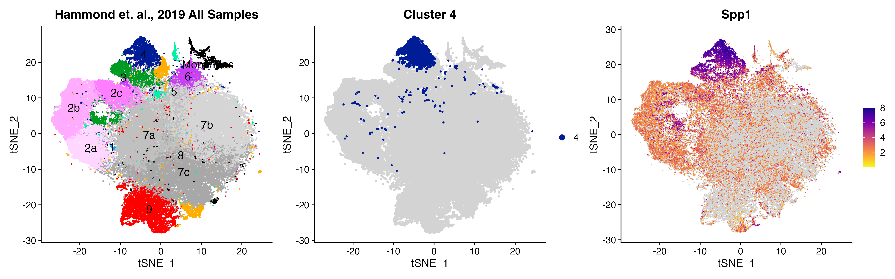

# Hammond-et-al_2019_Microglia_scRNAseq

#### Analysis Objects to Download for:  
### [**Single-Cell RNA Sequencing of Microglia throughout the Mouse Lifespan and in the Injured Brain Reveals Complex Cell-State Changes (*Immunity*)**](https://doi.org/10.1016/j.immuni.2018.11.004)  
**Timothy R. Hammond<sup>1,\*</sup>**, Connor Dufort, Lasse Dissing-Olesen, Stefanie Giera, Adam Young, Alec Wysoker, Alec J. Walker, Frederick Gergits, Michael Segel, James Nemesh, **Samuel E. Marsh<sup>2,\#</sup>**, Arpiar Saunders, Evan Macosko, Florent Ginhoux, Jinmiao Chen, Robin J.M. Franklin, Xianhua Piao, Steven A. McCarroll, and Beth Stevens.

<sup><sup>1</sup>Performed analysis</sup>   
<sup><sup>2</sup>Created Objects/Repo</sup>  
<sup><sup>\*</sup>Analysis Contact (contact: timothy.hammond@sanofi.com)</sup>  
<sup><sup>\*</sup>Repo/Object Contact (contact: samuel.marsh@childrens.harvard.edu)</sup>  

## Table of Contents  
**[About the Datasets](https://github.com/samuel-marsh/Hammond-et-al_2019_Microglia_scRNAseq#about-the-datasets)**  
**[Object Creation](https://github.com/samuel-marsh/Hammond-et-al_2019_Microglia_scRNAseq#object-creation)**  
**[Downloading Objects](https://github.com/samuel-marsh/Hammond-et-al_2019_Microglia_scRNAseq#downloading-objects)**  
**[Loading & Basic Use of Objects](https://github.com/samuel-marsh/Hammond-et-al_2019_Microglia_scRNAseq#using-objects)**  


##  About the Datasets  
Analysis was performed in paper as described without use of bespoke object/file format.  However, to facilitate easier use of data in analyzed/annotated form we have created pseudo-objects.  
*NOTE: If you would like to query individual genes and their expression across clusters/ages you can use interactive web portal [microgliasinglecell.com](https://microgliasinglecell.com).*  

Objects described in this repo are available in 3 most popular formats for use in both R and Python (Seurat, SingleCellExperiment, and anndata).  

*The objects contain:*
- Raw & Normalized expression data.
- tSNE coordinates of analysis shown in paper.  
- Cluster annotation from paper.  
- Cell level meta data (age, sex, batch, etc)

*They do not contain:*
- Variable genes
- ICA factor loadings
- Scaled Data (removed to keep object size small, can be added using package functions)

### Object Creation  
#### Downloading data
Raw data matrices can be downloaded using browser from NCBI GEO [GSE121654](https://www.ncbi.nlm.nih.gov/geo/download/?acc=GSE121654&format=file).  If using command line you can use [ffq tool from Pacther lab](https://github.com/pachterlab/ffq).  


#### Creating Objects  
Raw data matrices were then processed in R using [scCustomize](https://samuel-marsh.github.io/scCustomize/) & [Seurat](https://github.com/satijalab/seurat) to create Seurat objects.  The steps and functions used for object creation are detailed in script: [01_Object_Creation.R](https://github.com/samuel-marsh/Hammond-et-al_2019_Microglia_scRNAseq/blob/main/01_Object_Creation.R).  


Objects were then converted (see [02_Object_Conversion.R](https://github.com/samuel-marsh/Hammond-et-al_2019_Microglia_scRNAseq/blob/main/02_Object_Conversion.R)) to SingleCellExperiment using `Seurat::as.SingleCellExperiment()` and anndata using `sceasy::convertFormat` functions.


## Downloading Objects  
Dataset objects can be downloaded from figshare either using browser or command line as detailed below.  

### Download via browser  
Datasets can be downloaded through browser using the following links:  

| Dataset | Figures | Type | Link |
| :-----: | :-----: | :------: | :------------: |
| All Samples | Figure 1 | [Seurat](https://github.com/satijalab/seurat/wiki/Seurat) | [All Sample Seurat](https://figshare.com/ndownloader/files/37606220) |
| All Samples | Figure 1 | [SCE](https://bioconductor.org/packages/release/bioc/html/SingleCellExperiment.html) | [All Sample SCE](https://figshare.com/ndownloader/files/37606391) |
| All Samples | Figure 1 | [anndata](https://anndata.readthedocs.io/en/latest/) | [All Sample anndata](https://figshare.com/ndownloader/files/37610792) |
| Young vs. Old | Figure 5 | [Seurat](https://github.com/satijalab/seurat/wiki/Seurat) | [Young vs. Old Seurat](https://figshare.com/ndownloader/files/37606217) |
| Young vs. Old | Figure 5 | [SCE](https://bioconductor.org/packages/release/bioc/html/SingleCellExperiment.html) | [Young vs. Old SCE](https://figshare.com/ndownloader/files/37606379) |
| Young vs. Old | Figure 5 | [anndata](https://anndata.readthedocs.io/en/latest/) | [Young vs. Old anndata](https://figshare.com/ndownloader/files/37610789) |

### Download via command line
**Seurat Objects**
```
# Download both objects in .zip
wget -O hammond_seurat.zip https://figshare.com/ndownloader/articles/21201463/versions/3

# Download All Samples Object
wget -O Hammond_et-al-2019_Seurat_Converted_v4.qs https://figshare.com/ndownloader/files/37606220

# Download Young vs. Old Samples Object
wget -O Hammond_et-al-2019_Aged_Seurat_Converted_v4.qs https://figshare.com/ndownloader/files/37606217
```

**SCE Objects**
```
# Download both objects in .zip
wget -O hammond_SCE.zip https://figshare.com/ndownloader/articles/21201472/versions/2

# Download All Samples Object
wget -O Hammond_et-al-2019_SCE_Converted_v1-16-0.qs https://figshare.com/ndownloader/files/37606391

# Download Young vs. Old Samples Object
wget -O Hammond_et-al-2019_Aged_SCE_Converted_v1-16-0.qs https://figshare.com/ndownloader/files/37606379
```

**anndata Objects**
```
# Download both objects in .zip
wget -O hammond_anndata.zip https://figshare.com/ndownloader/articles/21201616/versions/4

# Download All Samples Object
wget -O Hammond_et-al-2019_anndata_Converted_v0-8-0.h5ad https://figshare.com/ndownloader/files/37610792

# Download Young vs. Old Samples Object
wget -O Hammond_et-al-2019_Aged_anndata_Converted_v0-8-0.h5ad https://figshare.com/ndownloader/files/37610789
```

## Using Objects  
### Using Objects in R
Examples of some basic use and plotting of Seurat and SCE objects can be found in script: [03_Object_Usage_R.R](https://github.com/samuel-marsh/Hammond-et-al_2019_Microglia_scRNAseq/blob/main/03_Object_Usage_R.R).

Use of Seurat object also takes advantage of the ability to use [scCustomize](https://samuel-marsh.github.io/scCustomize/) for plotting:
```
library(tidyverse)
library(Seurat)
library(scCustomize)
library(patchwork)

p1 <- DimPlot(hammond_all_samples, cols = hammond_all_samples@misc$hammond_colors, pt.size = 0.25, raster = F, label = T, label.size = 5) + NoLegend() + ggtitle("Hammond et. al., 2019 All Samples") + theme(plot.title = element_text(hjust = 0.5))

p2 <- Cluster_Highlight_Plot(seurat_object = hammond_all_samples, cluster_name = 4, highlight_color = hammond_all_samples@misc$hammond_colors[[6]]) + ggtitle("Cluster 9") + theme(plot.title = element_text(hjust = 0.5))

p3 <- FeaturePlot_scCustom(seurat_object = hammond_all_samples, features = "Spp1")

p1 + p2 + p3
```


### Using Objects in Python  
We also provide a jupyter notebook with basic commands for loading and plotting objects using scanpy/anndata: [04_Object_Usage_Scanpy.ipynb](https://github.com/samuel-marsh/Hammond-et-al_2019_Microglia_scRNAseq/blob/main/04_Object_Usage_Scanpy.ipynb)
